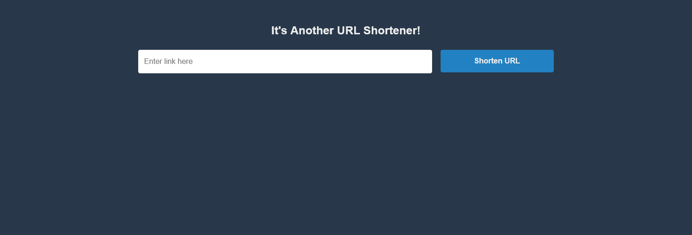
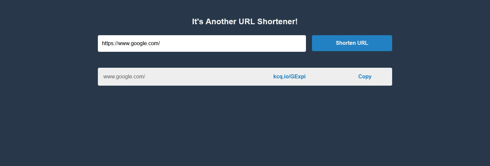
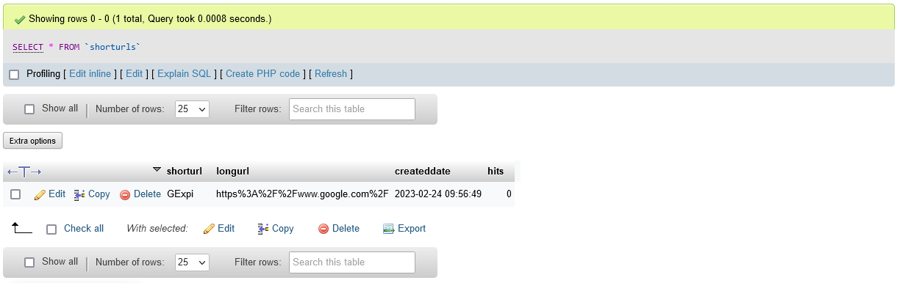

# IAUS (It's Another URL Shortener!)
Fast and simple project to create, host, and call short URLs.

## Background
There are a thousand of these apps online, but I was curious and bit bored.  Nothing groundbreaking here.

## What You'll Need
- a web host
- PHP
- MySQL

## My Approach
I started with [HTML5 Boilerplate](https://html5boilerplate.com/) for the front-end, and added jQuery for async processing.

Next I set up the database:
- single table ("shorturls") with 4 columns (shorturl, longurl, createddate, hits)

Then worked through each functional page:
- submit a new link
  - check database if submitted link already exists; if so, return corresponding short url
  - if it's a new link:
    - generate a new url
    - make sure that newly-generated short url doesn't already exist in database; if it does, keep trying until I get a unique short
    - insert the new long and short url into the database
    - return new short url
  - use jQuery to grab short link from submission and display back to screen
- read and redirect a short url
  - set up .htaccess to capture short url and send to redirect page
  - redirect page
    - grab short url and query database for corresponding long url
    - increment hit count for that url in the database
    - redirect user

And full disclosure, all the code here is mine (except for the HTML5 Boilerplate), but I did get my UI inspiration from the good folks at [rb.gy](https://rb.gy/).

## Installation
1. Grab/create relevant files
    - su.php: main landing page (or call it index.php or whatever)
    - su-config.php: config constants for database connection and other properties
    - su-submit.php: processor for submitted links
    - su-redirect.php: processor for redirecting links
    - .htaccess: for RewriteRules / redirects
    - css/custom.css: custom styles, including breakpoints for tablet/mobile
    - js/custom.js: jQuery handlers for submitted links 
2. Create database table "shorturls" with 4 columns (shorturl, longurl, createddate, hits)

## Possible Future To-Dos
- QR code generation
- Improve CSS

## Screenshots

